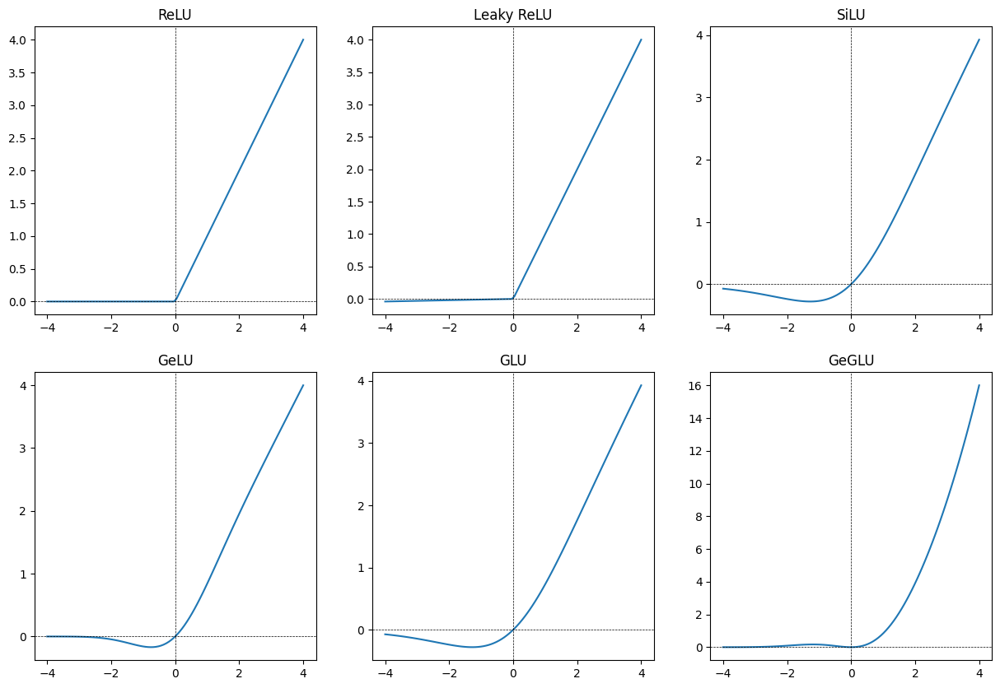

<script>
MathJax = {
  tex: {
    inlineMath: [['$', '$'], ['\\(', '\\)']]
  }
};
</script>

<script type="text/javascript" id="MathJax-script" async
  src="https://cdn.jsdelivr.net/npm/mathjax@3/es5/tex-mml-chtml.js">
</script>

<script id="MathJax-script" async
  src="https://cdn.jsdelivr.net/npm/mathjax@3/es5/tex-chtml.js">
</script>
<!-- 
References:

Ba, Jimmy Lei, Jamie Ryan Kiros, and Geoffrey E. Hinton. 2016. “Layer
Normalization.” <https://arxiv.org/abs/1607.06450>.

Dauphin, Yann N., Angela Fan, Michael Auli, and David Grangier. 2017.
“Language Modeling with Gated Convolutional Networks.”
<https://arxiv.org/abs/1612.08083>.

Devlin, Jacob, Ming-Wei Chang, Kenton Lee, and Kristina Toutanova. 2019.
“BERT: Pre-Training of Deep Bidirectional Transformers for Language
Understanding.” <https://arxiv.org/abs/1810.04805>.

Gulati, Anmol, James Qin, Chung-Cheng Chiu, Niki Parmar, Yu Zhang,
Jiahui Yu, Wei Han, et al. 2020. “Conformer: Convolution-Augmented
Transformer for Speech Recognition.” <https://arxiv.org/abs/2005.08100>.

Ramachandran, Prajit, Barret Zoph, and Quoc V. Le. 2017. “Searching for
Activation Functions.” <https://arxiv.org/abs/1710.05941>.

Shazeer, Noam. 2020. “GLU Variants Improve Transformer.”
<https://arxiv.org/abs/2002.05202>.

Team, Gemma, Thomas Mesnard, Cassidy Hardin, Robert Dadashi, Surya
Bhupatiraju, Shreya Pathak, Laurent Sifre, et al. 2024. “Gemma: Open
Models Based on Gemini Research and Technology.”
<https://arxiv.org/abs/2403.08295>.

Vaswani, Ashish, Noam Shazeer, Niki Parmar, Jakob Uszkoreit, Llion
Jones, Aidan N. Gomez, Lukasz Kaiser, and Illia Polosukhin. 2023.
“Attention Is All You Need.” <https://arxiv.org/abs/1706.03762>.

Yenduri, Gokul, Ramalingam M, Chemmalar Selvi G, Supriya Y, Gautam
Srivastava, Praveen Kumar Reddy Maddikunta, Deepti Raj G, et al. 2023.
“Generative Pre-Trained Transformer: A Comprehensive Review on Enabling
Technologies, Potential Applications, Emerging Challenges, and Future
Directions.” <https://arxiv.org/abs/2305.10435>. -->

#### The following code is for Deeplearning II course of PUCRS. The code is an implemnetation of the Transformer building blocks (transformer encoder and transformer decoder-only) Neural Network with some variations

<br />

# Introduction
The Transformer model was proposed in the paper [Attention is All You Need](https://arxiv.org/abs/1706.03762) by Vaswani et al. It is a simple architecture based solely on attention mechanisms, dispensing with recurrence and convolutions entirely. Despite its simplicity, the Transformer has proven to be a powerful model, yielding state-of-the-art results in a variety of domains.

In this Blog Post, we will implement the Transformer variants from scratch, focusing on the core components: self-attention and point-wise fully connected feed-forward networks. More specifically, we will implement the transformer encoder and the transformer decoder-only, introduced [BERT: Pre-Training of Deep Bidirectional Transformers for Language
Understanding](https://arxiv.org/abs/1810.04805) and [Generative Pre-Trained Transformer: A Comprehensive Review on Enabling Technologies, Potential Applications, Emerging Challenges, and Future Directions](https://arxiv.org/abs/2305.10435), respectively. We will define the model using PyTorch, show some variations of the model, and train it on a simple sentiment analysis task.

<br />
<br />

# Imports
First lets start with some imports:

```python
import torch
import torch.nn as nn
import torch.nn.functional as F
import torch.optim as optim

import numpy as np
```
<br />
<br />

# Architecture
The transformer archtecture is composed of an encoder and a decoder. The encoder is responsible for processing the input sequence, and the decoder is responsible for generating the output sequence. Both the encoder and decoder are composed of multiple layers of the same submodules. The submodules used in the transformer are:
- Multi-head self-attention mechanism
- Point-wise fully connected feed-forward network
- Layer normalization
- Residual connection
The transformer architecture is shown in the figure below:


In this post, we will implement the transformer encoder and the transformer decoder-only. The transformer decoder is similar to the transformer encoder, but it also has a multi-head attention mechanism that attends to the encoder's output (This specific attention mechanism is called cross-attention). The transformer decoder-only in the other hand, does not have the cross-attention mechanism, and its only difference is the mandatory masking of the self-attention mechanism.
<br />
<br />

# Attention Mechanism
The attention mechanism is a key component of the transformer model. It allows the model to focus on different parts of the input sequence when processing each token. The attention mechanism is defined as follows:
$$
Q \in \mathbb{R}^{n \times d_k}, \>\>\>\>\>\> K \in \mathbb{R}^{m \times d_k}, \>\>\>\>\>\> V \in \mathbb{R}^{m \times d_v} \\


Q = XW^Q, \>\>\>\>\>\> K = XW^K, \>\>\>\>\>\> V = XW^V 
$$
$$
\text{Attention}(Q, K, V) = \text{softmax}\left(\frac{QK^T}{\sqrt{d_k}} + \text{M}\right)V
$$


Where $Q$, $K$, and $V$ are the query, key, and value matrices, respectively. They are obtained by multiplying the input matrix $X$ by the weight matrices $W^Q$, $W^K$, and $W^V$. The attention mechanism computes the dot product between the query and key matrices, scales it by the square root of the dimension of the key vectors, which prevents the dot products from becoming too large, and applies a softmax function to obtain the attention scores. The attention scores are then used to weight the value matrix, and the weighted values are summed to obtain the output of the attention mechanism.

The attention mechanism is also masked to ignore specific tokens. In the decoder, the self-attention mechanism is masked to prevent tokens from attending to future tokens, while in the encoder, it can be used to ignore padding tokens. The mask itself is a matrix with the same shape as the attention scores, where the elements that should be ignored are set to a very large negative values, so that their exponential, $e^x$, and consequently the softmax, $\frac{e^x}{\sum e^x}$, becomes zero.

The following code represents an implementation of Self-Attention mechanism in PyTorch:

```python
class Self_Attention(nn.Module):
    def __init__(self, d_model):
        '''
        Self Attention Layer
        d_model: Dimension of the model
        '''

        super(Self_Attention, self).__init__()
        self.d_model = d_model

        # Define Query, Key, Value weight matrices
        self.W_q = nn.Linear(d_model, d_model)
        self.W_k = nn.Linear(d_model, d_model)
        self.W_v = nn.Linear(d_model, d_model)


    def forward(self, x, mask=None):
        '''
        x:      Input
        mask:   Masking
        '''

        # Generate Query, Key, Value
        q = self.W_q(x)
        k = self.W_k(x)
        v = self.W_v(x)

        # Compute Attention
        attn_scores = torch.matmul(q, k) / np.sqrt(self.d_model)

        # Apply Mask
        if mask is not None:
            attn = attn_scores.masked_fill(mask == 1, -1e9)
        attn = F.softmax(attn_scores, dim=-1)


        # Weighted Sum
        out = torch.matmul(attn, v)

        return out
```
<br />
<br />

# Multi-Head Attention
The multi-head attention mechanism is an extension of the attention mechanism that allows the model to focus on different parts of the input sequence simultaneously. It works by splitting the query, key, and value matrices into multiple heads, computing the attention mechanism for each head, and concatenating the outputs. The multi-head attention mechanism is defined as follows:
<br />
$$
Q \in \mathbb{R}^{n \times d_k}, \>\>\>\>\>\> K \in \mathbb{R}^{m \times d_k}, \>\>\>\>\>\> V \in \mathbb{R}^{m \times d_v} \\
Q = XW^Q, \>\>\>\>\>\> K = XW^K, \>\>\>\>\>\> V = XW^V \\
\text{MultiHead}(Q, K, V) = \text{Concat}(\text{head}_1, \text{head}_2, ..., \text{head}_h)W^O \\
\text{head}_i = \text{Attention}(QW_i^Q, KW_i^K, VW_i^V)
$$
<br />
Where the Attention function is the same as the one defined above, and $W^O$ is the output weight matrix, $W^O \in \mathbb{R}^{hd_v \times d_{model}}$, where $h$ is the number of heads, $d_v$ is the dimension of the value vectors, and $d_{model}$ is the dimension of the model. The multi-head attention mechanism is used in the transformer model to allow the model to focus on different parts of the input sequence simultaneously.

The following code is a modification of the Self-Attention mechanism to implement the Multi-Head Attention mechanism in PyTorch (only modifications are commented):

```python
class Self_Attention(nn.Module):
    def __init__(self, d_model, n_heads):
        super(Self_Attention, self).__init__()
        self.d_model = d_model
        self.n_heads = n_heads

        if d_model % n_heads != 0:
            raise ValueError("d_model must be a multiple of n_heads")
        
        self.d_k = d_model / n_heads
        self.W_q = nn.Linear(d_model, d_model)
        self.W_k = nn.Linear(d_model, d_model)
        self.W_v = nn.Linear(d_model, d_model)


    def forward(self, x, mask=None):
        q = self.W_q(x)
        k = self.W_k(x)
        v = self.W_v(x)

        # Split heads: reshape to execute multiple heads in parallel
        q = q.view(-1, self.n_heads, self.d_k)
        k = k.view(-1, self.n_heads, self.d_k)
        v = v.view(-1, self.n_heads, self.d_k)

        # Permute for matrix multiplication
        q = q.permute(1, 0, 2)
        k = k.permute(1, 2, 0)
        v = v.permute(1, 0, 2)

        attn_scores = torch.matmul(q, k) / np.sqrt(self.d_k)
        if mask is not None:
            attn = attn_scores.masked_fill(mask == 1, -1e9)
        attn = F.softmax(attn_scores, dim=-1)

        out = torch.matmul(attn, v)
        out = out.permute(1, 0, 2).contiguous().view(-1, self.d_model)
        return out
```

One extra multiplication is to calculate the $Q$, $K$, and $V$ values in parallel. This can be done by aplying a single transformation matrix to the input and then splitting the output into the individual $Q$, $K$, and $V$ matrices. The following code implements this modification (only modifications are commented):

```python
class Self_Attention(nn.Module):
    def __init__(self, d_model, n_heads):
        super(Self_Attention, self).__init__()
        self.d_model = d_model
        self.n_heads = n_heads
        self.d_k = d_model // n_heads

        # Define a single transformation matrix for Q, K, and V
        self.W_qkv = nn.Linear(d_model, 3*d_model)


    def forward(self, x, mask=None):
        # Generate Query, Key, Value in parallel
        qkv = self.W_qkv(x)

        # Split Q, K, V
        q, k, v = torch.chunk(qkv, 3, dim=-1)

        q = q.view(-1, self.n_heads, self.d_k)
        k = k.view(-1, self.n_heads, self.d_k)
        v = v.view(-1, self.n_heads, self.d_k)

        q = q.permute(1, 0, 2)
        k = k.permute(1, 2, 0)
        v = v.permute(1, 0, 2)

        attn_scores = torch.matmul(q, k) / np.sqrt(self.d_k)
        if mask is not None:
            attn = attn_scores.masked_fill(mask == 1, -1e9)
        attn = F.softmax(attn_scores, dim=-1)

        out = torch.matmul(attn, v)
        out = out.permute(1, 0, 2).contiguous().view(-1, self.d_model)
        return out
```
<br />
<br />

# Feed-Forward Network
The Transformer Feed-Forward Network (FFN) can be defined as a Neural Network which has its output as the same shape as its input. The FFN is used in the transformer model to process the output of the multi-head attention mechanism. In the original transformer model, the FFN is composed of two linear layers with a ReLU activation function in between. Modern Transformer models implement other activations functions, such as GEGLU, in [Gemma: Open
Models Based on Gemini Research and Technology.](https://arxiv.org/abs/2403.08295) by Team Gemma et al., and some even use convolutional layers instead of fully connected layers, as in [Conformer: Convolution-Augmented Transformer for Speech Recognition.](https://arxiv.org/abs/2005.08100) by Gulati et al. 
A simple implementation of the FFN is shown below:

```python
class FFN(nn.Module):
    def __init__(self, d_model, activation=nn.ReLU()):
        '''
        Feed-Forward Network
        d_model:    Dimension of the model
        activation: Activation function
        '''
        super(FFN, self).__init__()
        # Define the activation function
        self.activation = activation

        # Define the linear layers
        self.linear1 = nn.Linear(d_model, d_ff)
        self.linear2 = nn.Linear(d_ff, d_model)

    def forward(self, x):
        x = self.linear1(x)
        x = F.relu()
        x = self.linear2(x)
        return x
```
<br />

### Some implementations of activation functions that can be used in the FFN:

```python
class ReLU:
    def __init__(self):
        pass

    def forward(self, x):
        return torch.max(x, torch.tensor(0.0))
    
class LeakyReLU:
    def __init__(self, alpha=0.01):
        self.alpha = alpha

    def forward(self, x):
        return torch.max(x, self.alpha * x)
    
class SiLU:
    def __init__(self):
        pass

    def forward(self, x):
        return x * torch.sigmoid(x)
    
class GeLU:
    def __init__(self):
        pass

    def forward(self, x):
        return 0.5 * x * (1 + torch.tanh(np.sqrt(2 / np.pi) * (x + 0.044715 * torch.pow(x, 3))))
    
class GLU:
    def __init__(self):
        pass

    def forward(self, a, b):
        return a * torch.sigmoid(b)
    
class GeGLU:
    def __init__(self):
        pass

    def forward(self, a, b):
        return 0.5 * a * (1 + torch.tanh(np.sqrt(2 / np.pi) * (b + 0.044715 * torch.pow(b, 3))))
```
<br />


### Activation Functions Graphs:



**Note: The GeGLU activation function is a combination of the GeLU and GLU activation functions. It takes two inputs, $a$ and $b$, and returns the element-wise product of the GeLU and GLU activations of $a$ and $b$, respectively, the plot assumes that $a = b$.**
<br />
<br />
<br />


# Layer Normalization
Layer normalization is a technique used to normalize the activations of a neural network layer. It is similar to batch normalization, but instead of normalizing the activations across the batch dimension, it normalizes the activations across the feature dimension. Layer normalization is used in the transformer model to stabilize the training process and improve the performance of the model. The layer normalization is defined as follows:

$$
\text{LayerNorm}(x) = \gamma \odot \frac{x - \mu}{\sigma} + \beta
$$

Where $x$ is the input tensor, $\gamma$ and $\beta$ are learnable parameters, and $\mu$ and $\sigma$ are the mean and standard deviation of the input tensor, respectively. The layer normalization is applied to the output of the multi-head attention mechanism and the feed-forward network in the transformer model.
In contrast with batch normalization, layer normalization is applied to a 'layer', which is a single example in the batch/mini-batch, while batch normalization is applied to every feature in the batch/mini-batch.

```python
class LayerNorm(nn.Module):
    def __init__(self, eps=1e-6):
        '''
        Layer Normalization
        eps: Epsilon
        '''
        super(LayerNorm, self).__init__()
        self.eps = eps
        self.gamma = nn.Parameter(1)
        self.beta = nn.Parameter(0)


    def forward(self, x):
        mean = x.mean(dim=-1, keepdim=True)
        std = x.std(dim=-1, keepdim=True)
        out = self.gamma * (x - mean) / (std + self.eps) + self.beta
        return out
```
<br />
<br />

# Residual Connection
The residual connection is a technique used to improve the training of deep neural networks. It works by adding the input of a layer to the output of the layer, allowing the gradients to flow directly through the layer. The residual connection is used in the transformer model to improve the training process and help the model learn complex patterns, while also allowing the model to be deeper. The residual connection is defined as follows:

$$
\text{Residual}(x, F) = x + F(x)
$$

Where $x$ is the input tensor and $F$ is the function that represents the layer. The residual connection is applied to the output of the multi-head attention mechanism and the feed-forward network in the transformer model.
<br />
<br />
<br />


# Transformer Encoder/Decoder-Only

Taking all the building blocks together, we can define the transformer encoder and the transformer decoder-only. We can define a single class, which can adapt to being an encoder or a decoder-only by changing the mask parameter in the self-attention mechanism. The transformer encoder and decoder-only are defined as follows:

```python
class Transformer(nn.Module):
    def __init__(self, d_model, n_heads, ffn, transformer_type='encoder'):
        '''
        Transformer Encoder/Decoder-Only
        d_model:            Dimension of the models hidden states
        n_heads:            Number of heads in the multi-head attention mechanism
        ffn:                Feed-Forward Network
        transformer_type:   Type of the transformer (encoder/decoder-only)
        '''
        if transformer_type not in ['encoder', 'decoder-only']:
            raise ValueError("Invalid type. Must be 'encoder' or 'decoder-only'")

        super(Transformer, self).__init__()
        self.d_model = d_model
        self.n_heads = n_heads
        self.transformer_type = transformer_type

        # Declare internal Layers
        self.self_attn = Self_Attention(d_model, n_heads)
        self.layer_norm1 = LayerNorm()
        self.ffn = ffn
        self.layer_norm2 = LayerNorm()

    def forward(self, x, mask=None):
        '''
        x: Input
        mask: Masking
        '''
        # If decoder-only, edit the mask, so that the self-attention mechanism cannot attend to future tokens
        if self.transformer_type == 'decoder-only':
            mask = mask | torch.triu(torch.ones(x.size(-2), x.size(-2)), diagonal=1)

        # Self-Attention
        attn = self.self_attn(x, mask)

        # Residual Connection
        x = x + attn

        # Layer Normalization
        x = self.layer_norm1(x)

        # Feed-Forward Network
        ffn = self.ffn(x)

        # Residual Connection
        x = x + ffn

        # Layer Normalization
        x = self.layer_norm2(x)

        return x
```
<br />
<br />

# PyTorch Implementation
Although we did implement the transformer encoder and the transformer decoder-only from scratch, and there is value in knowing its inner workings, PyTorch already has an implementation of the transformer model, and its building blocks, in the `torch.nn` module.
<br />

### Multi-Head Attention:
```python
import torch.nn.MultiheadAttention
multihead_attn = nn.MultiheadAttention(embed_dim, num_heads)
```
<br />

### Layer Normalization:
```python
import torch.nn.LayerNorm
layer_norm = nn.LayerNorm(normalized_shape)
```
<br />

### Transformer Encoder:
```python
import torch.nn.TransformerEncoder, torch.nn.TransformerEncoderLayer
transformer_encoder = nn.TransformerEncoder(encoder_layer, num_layers)
```

### Activation Functions:
**From Torch.nn.functional:**
```python
import torch.nn.functional as F
F.relu(x)
F.leaky_relu(x, alpha=0.01)
F.silu(x)
F.gelu(x)
F.glu(a, b)
F.gelgu(a, b)
```
<br />

**From Torch.nn:**
```python
import torch.nn.ReLU, torch.nn.LeakyReLU, torch.nn.SiLU, torch.nn.GELU, torch.nn.GLU, torch.nn.GeGLU
relu = nn.ReLU()
leaky_relu = nn.LeakyReLU(alpha=0.01)
silu = nn.SiLU()
gelu = nn.GELU()
glu = nn.GLU()
geglu = nn.GeGLU()
```
<br />

# Conclusion
In this Blog Post, we explored the transformer model and its building blocks: self-attention, multi-head attention, feed-forward network, layer normalization, and residual connection. We implemented the transformer encoder and the transformer decoder-only, focusing on the core components of the model. We also showed some variations of the model, such as the multi-head attention mechanism and the feed-forward network. The transformer model has proven to be a powerful model, yielding state-of-the-art results in a variety of domains, and we hope this Blog Post helps you understand how it works and how to implement it from scratch.
<br />
<br />


# PyTorch Resources

### Layers:
- [Multi-Head Attention](https://pytorch.org/docs/stable/generated/torch.nn.MultiheadAttention.html#torch.nn.MultiheadAttention)
- [Layer Normalization](https://pytorch.org/docs/stable/generated/torch.nn.LayerNorm.html#torch.nn.LayerNorm)
- [Transformer Encoder](https://pytorch.org/docs/stable/generated/torch.nn.TransformerEncoder.html#torch.nn.TransformerEncoder)
<br />
<br />

### Activation Functions:
- [Activation Functions](https://pytorch.org/docs/stable/nn.functional.html#activation-functions)
- [Torch.nn.functional](https://pytorch.org/docs/stable/nn.functional.html)
<br />
<br />

### Specific Activation Functions:
- [ReLU](https://pytorch.org/docs/stable/generated/torch.nn.ReLU.html)
- [LeakyReLU](https://pytorch.org/docs/stable/generated/torch.nn.LeakyReLU.html)
- [SiLU](https://pytorch.org/docs/stable/generated/torch.nn.SiLU.html)
- [GELU](https://pytorch.org/docs/stable/generated/torch.nn.GELU.html)
- [GLU](https://pytorch.org/docs/stable/generated/torch.nn.GLU.html)
- [GeGLU](https://pytorch.org/docs/stable/generated/torch.nn.GeGLU.html)
<br />
<br />

### Other Resources:
- [Torch.nn](https://pytorch.org/docs/stable/nn.html)


<br />
<br />
<br />
<br />


# References

- Vaswani, Ashish, Noam Shazeer, Niki Parmar, Jakob Uszkoreit, Llion
Jones, Aidan N. Gomez, Lukasz Kaiser, and Illia Polosukhin. 2023.
“Attention Is All You Need.” <https://arxiv.org/abs/1706.03762>.

- Devlin, Jacob, Ming-Wei Chang, Kenton Lee, and Kristina Toutanova. 2019.
“BERT: Pre-Training of Deep Bidirectional Transformers for Language
Understanding.” <https://arxiv.org/abs/1810.04805>.

- Yenduri, Gokul, Ramalingam M, Chemmalar Selvi G, Supriya Y, Gautam
Srivastava, Praveen Kumar Reddy Maddikunta, Deepti Raj G, et al. 2023.
“Generative Pre-Trained Transformer: A Comprehensive Review on Enabling
Technologies, Potential Applications, Emerging Challenges, and Future
Directions.” <https://arxiv.org/abs/2305.10435>.

- Team, Gemma, Thomas Mesnard, Cassidy Hardin, Robert Dadashi, Surya
Bhupatiraju, Shreya Pathak, Laurent Sifre, et al. 2024. “Gemma: Open
Models Based on Gemini Research and Technology.”
<https://arxiv.org/abs/2403.08295>.

- Gulati, Anmol, James Qin, Chung-Cheng Chiu, Niki Parmar, Yu Zhang,
Jiahui Yu, Wei Han, et al. 2020. “Conformer: Convolution-Augmented
Transformer for Speech Recognition.” <https://arxiv.org/abs/2005.08100>.

- Ba, Jimmy Lei, Jamie Ryan Kiros, and Geoffrey E. Hinton. 2016. “Layer
Normalization.” <https://arxiv.org/abs/1607.06450>.

- Dauphin, Yann N., Angela Fan, Michael Auli, and David Grangier. 2017.
“Language Modeling with Gated Convolutional Networks.”
<https://arxiv.org/abs/1612.08083>.

- Ramachandran, Prajit, Barret Zoph, and Quoc V. Le. 2017. “Searching for
Activation Functions.” <https://arxiv.org/abs/1710.05941>.

- Shazeer, Noam. 2020. “GLU Variants Improve Transformer.”
<https://arxiv.org/abs/2002.05202>.
